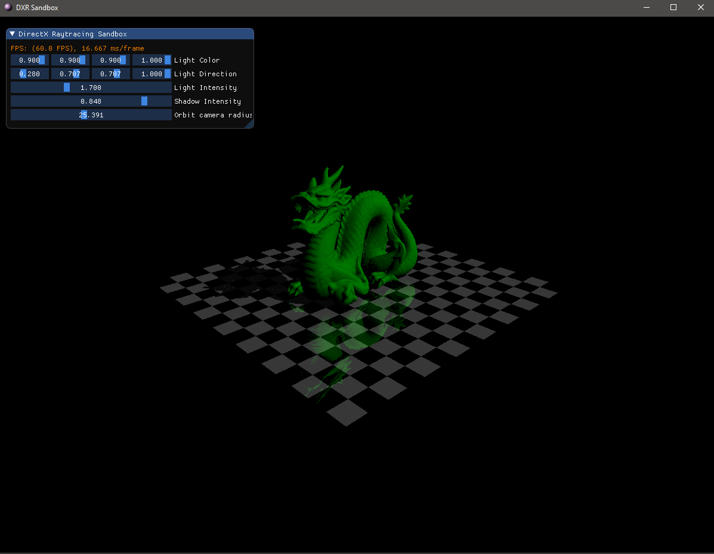

# DXR-Sandbox
A very simple toy-framework for testing DirectX Raytracing and improving DirectX 12 knowledge.

I have used a couple of classes from:
- Microsoft samples (https://github.com/microsoft/DirectX-Graphics-Samples/tree/master/Samples/Desktop/D3D12Raytracing)
- NVIDIA samples (https://github.com/NVIDIAGameWorks/DxrTutorials/) 
- and was inspired by FeaxRenderer (https://github.com/KostasAAA/FeaxRenderer)

This project is not an ideal engine but just a way to test things quickly if you want to learn DXR. I am not a DX12 expert which is why some things could be done better.

# Features (not raytracing)
- Deferred Rendering (without texture support for now)
- 3D model loading with Assimp
- Orbit camera
- ImGUI

# Features (raytracing)
- full essential DXR setup with RayGen/Miss/Hit shaders, accelaration structures, etc.
- reflections 
- shadows

# TODO 
- ~~Combine raytracing ouput with deferred lighting~~
- ~~Ray Traced Shadows~~
- ~~Ray Traced Reflections~~
- Ray Traced Ambient Occlusion
- PBR/texture support
- ~~ImGUI~~

# Additional dependencies
- Assimp
- DirectXTK12
- ImGUI

# Requirements
- VS2019
- DirectX12 with DXR
- latest Windows SDK
- GPU with RTX support
