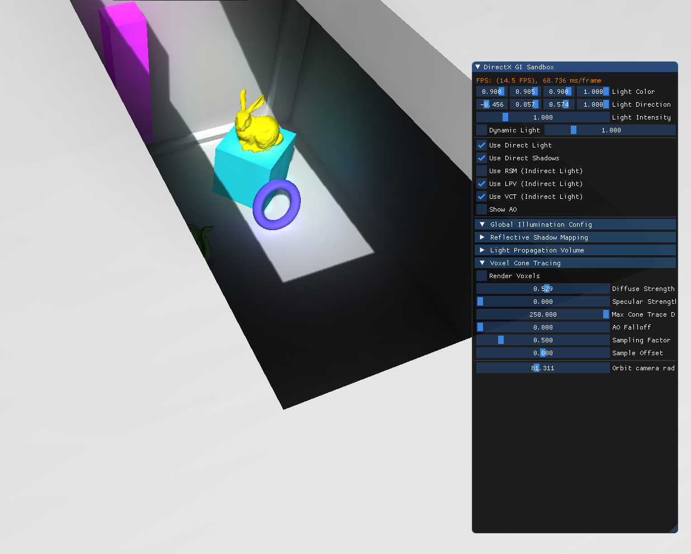

# About
Simple C++/DX12 framework for my bachelor thesis on real-time global illumination techniques
(WIP)

# Features
- Deferred Rendering
- Shadow Mapping
- GI w/ Reflective Shadow Mapping (indirect diffuse)
- GI w/ Light Propagation Volume (indirect diffuse)
- GI w/ Voxel Cone Tracing (indirect diffuse + specular + AO)

# Optimizations
Reflective Shadow Mapping:
- main pass in compute
- efficient upsample & blur of main pass' output in compute
- async compute of main, upsample & blur passes

Light Propagation Volumes:
- flux downsample in compute
- DX12 bundle for propagation passes

Voxel Cone Tracing:
- main pass in compute
- anisotropic mipmapping passes in compute
- efficient upsample & blur of main pass' output in compute
- async compute of main, mipmapping, upsample & blur passes

# Additional dependencies
- Assimp
- DirectXTK12
- ImGUI

# Requirements
- VS2019
- DirectX12 with DXR
- latest Windows SDK
- GPU with RTX support (if using DXR)
