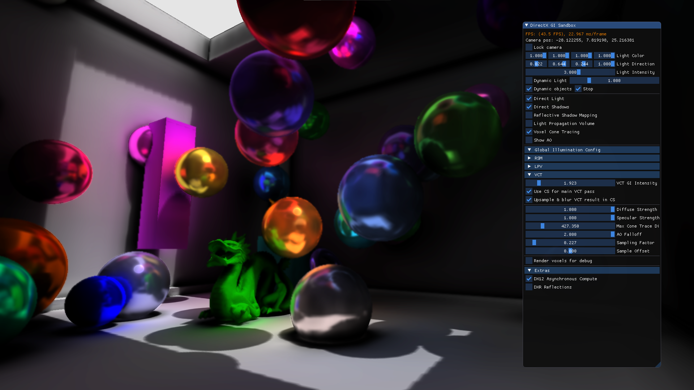
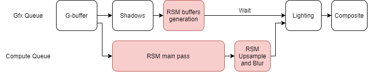
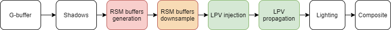
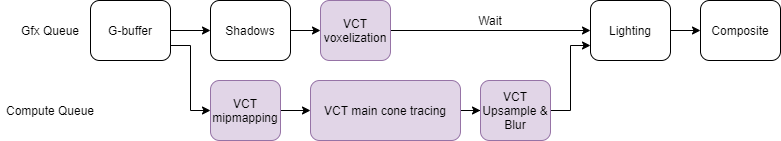
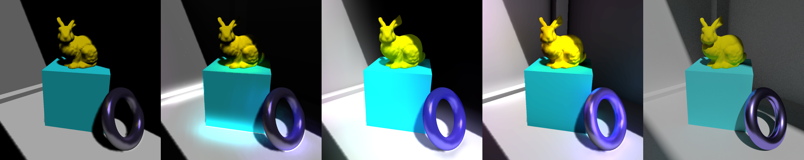
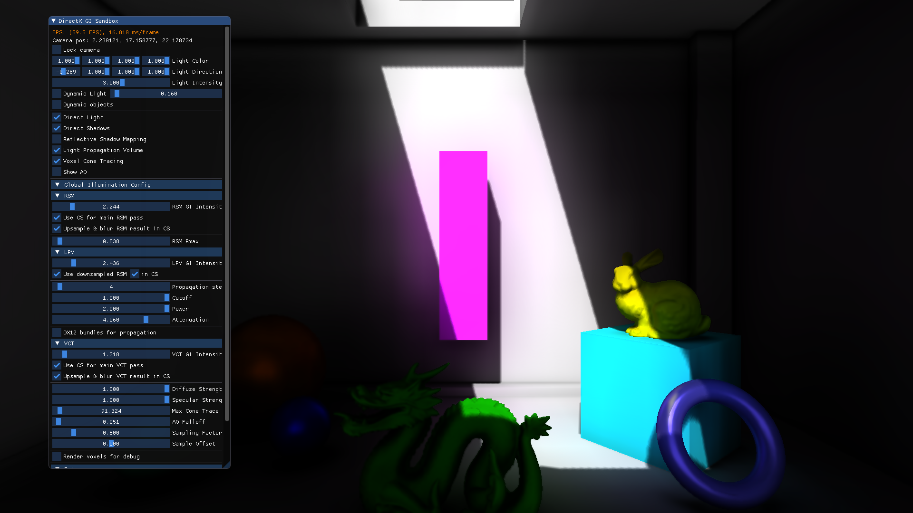
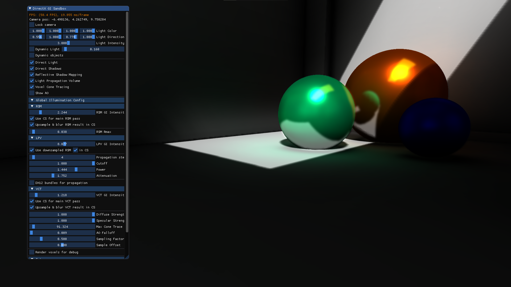
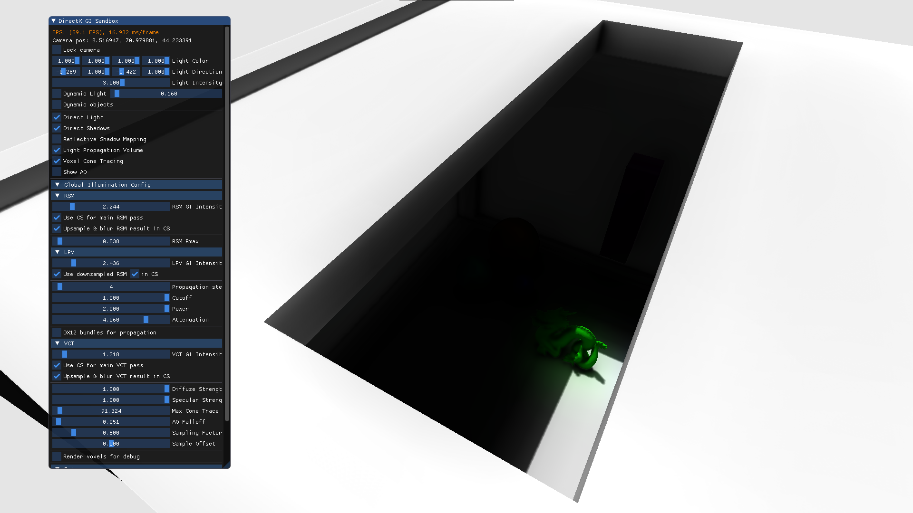

# About
Simple C++/DX12 framework for my bachelor thesis "Dynamic real-time global illumination algorithms on modern GPU hardware and software" ([paper](thesis.pdf)).

Video: https://youtu.be/4YUWw8x4XXc

# Features
- Deferred Rendering
- Shadow Mapping
- GI w/ Reflective Shadow Mapping (indirect diffuse)
- GI w/ Light Propagation Volume (indirect diffuse)
- GI w/ Voxel Cone Tracing (indirect diffuse + specular + AO)
- SSAO
- Asynchronous compute
- DXR Reflections + Blur

# Optimizations
Reflective Shadow Mapping:
- main pass in compute (+async)
- efficient upsample & blur of main pass' output in compute (+async)

Light Propagation Volumes:
- flux downsample in compute
- DX12 bundle for propagation passes

Voxel Cone Tracing:
- main pass in compute (+async)
- anisotropic mipmapping passes in compute (+async)
- efficient upsample & blur of main pass' output in compute (+async)

SSAO:
- TODO: downscaled version
- TODO: move to compute with LDS optimizations
- TODO: move to async

# Comparison
No GI -> RSM -> LPV -> VCT -> offline path-tracer

# Additional screenshots

# Dependencies
- Assimp
- DirectXTK12
- ImGUI

# Requirements
- VS2019
- DirectX12
- Windows 10 (1809+)
- latest Windows SDK
- NVIDIA GPU with RTX support (if using DXR)
